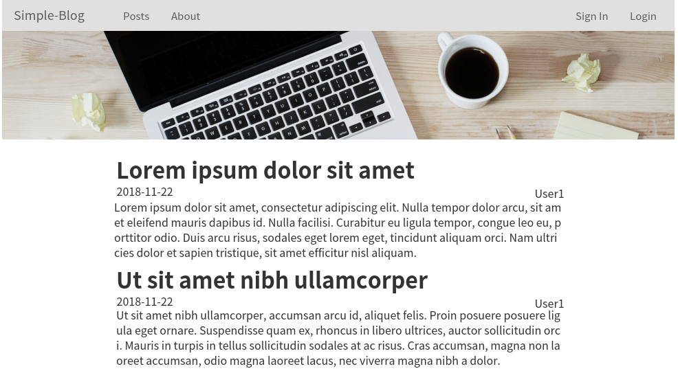

simple-blog 프로젝트 
=============
> 단순한 기능을 가진 블로그 서비스를 만들어 가면서 Node.js 기반 웹 서비스를 학습하는 것이 목적입니다.

[주의: 완료된 프로젝트가 아닙니다.](#)

## 기능
* 상단 Navbar
  * Logo
  * 게시물 보기
  * About 보기
  * 가입
  * 탈퇴
  * 로그인
  * 로그아웃
  
* 사용자
  * 가입
  * 탈퇴
  * 로그인
  * 로그아웃
  
* 게시글
  * 글 읽기
  * 글 쓰기
  * 글 삭제
  * 글 수정
  * 로그인 했을 때만 쓰기 가능
  * 자신이 쓴 글만 삭제, 수정 가능
 
* 댓글
  * 읽기
  * 쓰기
  * 삭제
  * 수정
  * 로그인 했을 때만 쓰기 가능
  * 자신이 쓴 댓글만 삭제, 수정 가능
  
## 스크린샷

## 디자인 계획
디자인 보기: [oven 링크](https://ovenapp.io/view/hzDWxZMzUtwAjSHxIiWpIWItftWW9Adg/onq7i)

## 사용 기술/프레임웍
* HTML
* CSS
* Javascript
* Node.js
* Express
* Mongoose
* Bootstrap 4
* MongoDB

## 개발 환경
AWS Cloud9: [링크](https://aws.amazon.com/cloud9/)
